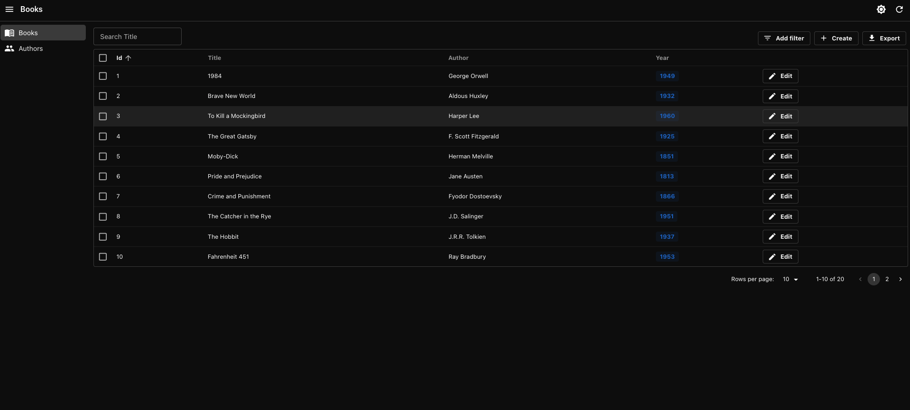

# 📚 React Admin Books Management

A clean and simple Book & Author Management Dashboard built using **[React Admin](https://marmelab.com/react-admin/)**, backed by a local **JSON Server**. Perfect for demoing admin dashboards with RESTful APIs.


🔗 Live Demo: https://react-admin-books.vercel.app




---

## 🚀 Features

- 📖 Manage books and authors from a responsive admin panel
- ⚙️ JSON Server backend with mock data
- 🔍 Filtering, pagination, and sorting
- ✏️ Edit, delete, and add resources
- 🛠️ Built with `React Admin`, `Material UI`, `TypeScript`, and `Vite`

---

## ✅ Prerequisites

- [Node.js](https://nodejs.org/) (v14 or newer)
- npm (v6+) or yarn

---

## 🛠️ Getting Started

### 1. Clone the Repository

```bash
git clone https://github.com/samrjj32/react-admin-books.git
cd react-admin-books
```

### 2. Install Dependencies

```bash
npm install
# or
yarn install
```

### 3. Run the Application

> This project uses [`concurrently`](https://www.npmjs.com/package/concurrently) to run both the React Admin frontend and the JSON Server simultaneously.

```bash
npm run dev
```

- 🌐 React Admin App: [http://localhost:5173](http://localhost:5173)
- 📦 JSON Server API: [http://localhost:3001](http://localhost:3001)

---

## 📁 Project Structure

```
react-admin-books/
├── public/                  # Static assets
├── src/                     # Source code
│   ├── authors/             # Author-related components
│   ├── books/               # Book-related components
│   ├── components/          # Reusable shared components
│   ├── App.tsx              # Main App component
│   └── main.tsx             # Application entry point
├── books.json               # Mock data for JSON Server
├── package.json             # Project scripts and dependencies
```

## 📝 License

This project is licensed under the **MIT License** — feel free to use, share, and modify.

---

## 👨‍💻 Author

Made with ❤️ by [Samrajj](https://github.com/samrjj32)
